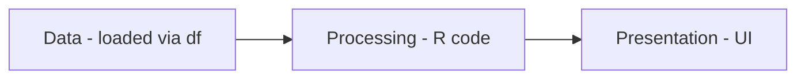
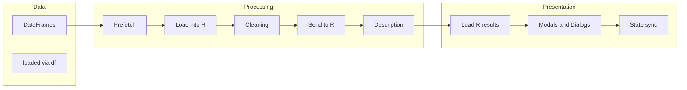
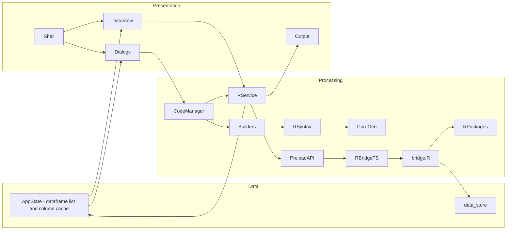
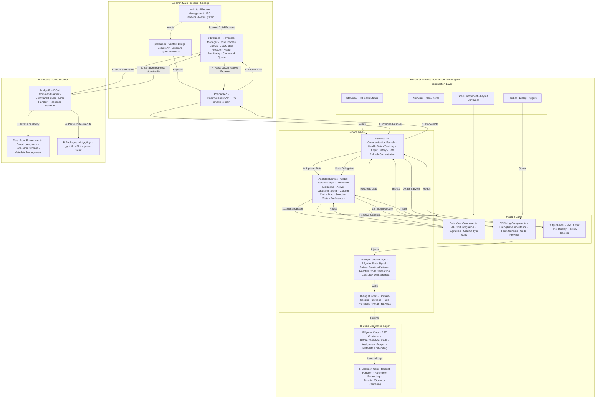
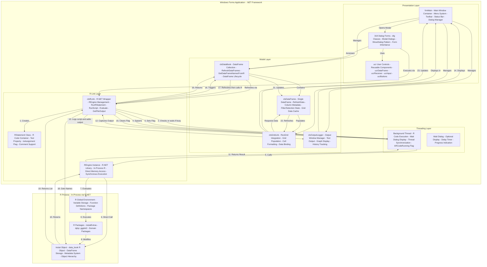

# R-Instat Architecture Documentation

## R-Instat in Three Bands: From Simple to Technical

Every part of R-Instat fits into three bands: **Data** (what is loaded and stored), **Processing** (R code and how it is prepared and run), and **Presentation** (UI and how results are shown). The diagrams below start from this literal view and add detail until they match the technical architecture.

### Level 1 – Literal

The simplest view: data flows from storage through R code to the user interface.

### Level 2 – Conceptual

The same three bands with the main concepts: prefetch and load into R, cleaning and sending to R, description; then loading R results, modals, and state sync in the UI.

### Level 3 – Electron Technical

The same frame with actual Electron app components: data_store and AppState in Data; CodeManager, Builders, RService, bridge.R in Processing; Shell, DataView, Dialogs, Output and AppState signals in Presentation.

Note: DataView requests data via RService (getDataPreview, getColumnTypes); results and state flow back into Presentation via AppState and Output.

### Level 4 – Full Technical View

The same Data, Processing, and Presentation frame is preserved in the full architecture diagram below, which adds **process boundaries** (Electron Main, Renderer, R child process) and **full component names** for every layer. See **Complete System Architecture (Data Flow Integrated)** below for that view.

## Electron App Architecture with Integrated Data Flow

### Complete System Architecture (Data Flow Integrated)

**Architectural Layers Explained:**

1. **Electron Main Process**: Node.js process managing application lifecycle, window creation, and IPC handlers. Runs with full Node.js API access.

2. **Renderer Process**: Chromium-based browser process running Angular application. Sandboxed for security, communicates via IPC only.

3. **IPC Communication Layer**: Secure bridge between main and renderer processes. Uses contextBridge to expose limited, type-safe APIs.

4. **R Process**: Separate child process running R interpreter. Communicates via JSON over stdio (stdin/stdout). Isolated from main application.

**Data Flow Through Layers:**

**User Input → R Execution Flow:**

1. User interacts with dialog component (selects column, sets options)
2. Component updates signals (reactive state)
3. Dialog reads computed `rCode()` signal from CodeManager
4. CodeManager calls builder function (pure function)
5. Builder constructs RSyntax AST using composable primitives
6. RSyntax.toScript() converts AST to R code string
7. CodeManager stores RSyntax in signal (reactive update)
8. Dialog displays code preview reactively
9. User clicks Execute → CodeManager.execute(rService)
10. RService.execute() invokes Electron IPC
11. IPC message sent to main process via contextBridge
12. Main process IPC handler calls RBridge
13. RBridge writes JSON command to R process stdin
14. R process (bridge.R) parses JSON, routes to handler
15. Handler executes R code, accesses/modifies data_store
16. Response serialized to JSON, written to stdout
17. RBridge reads stdout, parses JSON response
18. Promise resolves back through IPC chain
19. RService updates AppStateService (dataframes, columns)
20. AppStateService signals update all subscribed components
21. DataView refreshes grid, Output displays results

**R Results → UI Update Flow:**

1. R execution completes, returns JSON response
2. Response contains: success flag, data preview, error message
3. RBridge parses response, resolves pending Promise
4. IPC returns result to renderer process
5. RService receives result, updates output history
6. RService calls refreshDataframes() if data changed
7. AppStateService updates dataframe list signal
8. AppStateService invalidates column cache
9. DataView component reacts to signal change
10. DataView requests new data preview via RService
11. RService calls IPC → RBridge → R process
12. R returns paginated data preview
13. DataView updates AG Grid with new row data
14. Output panel displays execution result

**Key Data Structures:**

- **RSyntax**: Immutable AST container with before/base/after code sections
- **RFunction**: Typed representation of R function calls with parameters
- **RResponse**: JSON structure with `{id, success, data, error}`
- **DataPreview**: `{columns: string[], rows: any[][], totalRows: number}`
- **AppState**: Signals for dataframes, active dataframe, column cache, selections

## VB.net App Architecture with Integrated Data Flow

### Complete System Architecture (Data Flow Integrated)

**Architectural Layers Explained:**

1. **Presentation Layer**: Windows Forms UI with modal dialog pattern. Main form (frmMain) acts as container and coordinator.

2. **Model Layer**: Business logic and data management. clsDataBook maintains collection of clsDataFrame objects, each representing a data table.

3. **R Link Layer**: Bridge between VB.net and R via R.NET library. Provides synchronous, in-process R execution.

4. **Threading Layer**: Manages background execution of R code to prevent UI blocking. Optional wait dialog for long operations.

5. **R Process**: In-process R engine via R.NET. Direct memory access, no serialization overhead.

**Data Flow Through Layers:**

**User Input → R Execution Flow:**

1. User clicks menu item in MainForm
2. MainForm opens dialog via ShowDialog() (modal, blocking)
3. Dialog loads, initializes controls (ucrDataFrame, ucrReceiver, etc.)
4. Dialog reads current state from DataBook (available dataframes)
5. User interacts with dialog controls (selects columns, sets options)
6. Dialog builds R code string via string concatenation
7. Dialog creates RStatement object with code text
8. Dialog calls clsRLink.RunRStatement(rStatement)
9. clsRLink checks if R code is running (bRCodeRunning flag)
10. If running, waits in loop (Thread.Sleep(5))
11. Sets bRCodeRunning = True
12. Spawns background thread for R execution
13. Thread calls clsEngine.Evaluate(script) (R.NET)
14. R.NET directly calls R engine (in-process)
15. R engine executes code in global environment
16. Code accesses/modifies instat object (data_book)
17. R execution completes, returns to R.NET
18. clsRLink captures output (if not assignment)
19. clsRLink adds output to clsOutputLogger
20. clsRLink logs script to file
21. Sets bRCodeRunning = False
22. Dialog closes (ShowDialog returns)
23. MainForm triggers DataBook refresh
24. DataBook calls R to get dataframe names
25. DataBook updates clsDataFrame collection
26. Each clsDataFrame refreshes its data
27. GridLink updates ReoGrid control
28. MainForm displays updated grid

**R Results → UI Update Flow:**

1. R execution completes, returns result
2. clsRLink determines output type (text, graph, assignment)
3. For non-assignments, wraps in view_object_data() call
4. Executes view_object_data to capture output
5. clsOutputLogger.AddOutput() called with code and output
6. Output window displays text/graph
7. If data changed, DataBook.RefreshDataFrames() called
8. DataBook calls R: `names(data_book$data_tables)`
9. R returns list of dataframe names
10. DataBook compares with existing clsDataFrame objects
11. Removes deleted dataframes, adds new ones
12. For each dataframe, calls RefreshData()
13. clsDataFrame calls R to get row/column counts
14. clsDataFrame calls R to get column metadata
15. clsDataFrame caches data for grid display
16. GridLink binds cached data to ReoGrid
17. ReoGrid renders cells with formatting
18. MainForm displays updated grid

**Key Data Structures:**

- **RStatement**: Container for R code string with metadata (IsAssignment, Comment)
- **clsDataFrame**: VB.net object representing single dataframe with cached data
- **clsDataBook**: Collection manager for all dataframes, maintains sync with R
- **REngine**: R.NET wrapper providing direct access to in-process R interpreter
- **OutputEntry**: Text/graph output stored in clsOutputLogger for display

**Synchronous vs Asynchronous:**

- R execution runs in background thread but UI is blocked by modal dialog
- DataBook refresh happens synchronously after dialog closes
- Grid updates are synchronous, blocking UI during large data loads

## Architecture Comparison

### Electron App Advantages

#### 1. **Modern Technology Stack**
- **Angular 19**: Latest framework with signals-based reactivity, standalone components, modern control flow
- **TypeScript**: Full type safety from UI components to R code generation, compile-time error detection
- **Modern CSS**: Tailwind CSS 4 + DaisyUI 5 for responsive, themeable UI components
- **Web Standards**: Leverages modern web APIs, can integrate web libraries and tools

#### 2. **Security Architecture**
- **Process Isolation**: Renderer process sandboxed, cannot access Node.js APIs directly
- **Context Isolation**: Prevents renderer from accessing main process context
- **Secure IPC**: Only explicitly exposed APIs available via contextBridge
- **R Process Isolation**: R runs in separate child process, crashes don't affect main app
- **No Direct Memory Access**: JSON serialization prevents memory corruption risks

#### 3. **Cross-Platform Capability**
- **Single Codebase**: One codebase for Windows, macOS, and Linux
- **Native Integration**: Platform-specific menus, file dialogs, notifications
- **Consistent UX**: Same UI/UX across platforms with platform-specific polish
- **Electron Builder**: Automated packaging for all platforms

#### 4. **Architectural Separation**
- **Service Layer**: Clear separation between UI, business logic, and R communication
- **Composable Code Generation**: RSyntax AST enables reusable, testable R code builders
- **Reactive State**: Signals provide automatic reactivity without manual subscriptions
- **Single Source of Truth**: AppStateService centralizes all application state
- **Dependency Injection**: Angular DI enables testable, mockable components

#### 5. **Developer Experience**
- **Hot Module Replacement**: Instant feedback during development
- **Modern Tooling**: ESLint, Prettier, TypeScript compiler, Angular CLI
- **Component-Based**: Reusable, composable UI components
- **Testability**: Services and builders are pure functions, easy to unit test
- **Debugging**: Chrome DevTools for renderer, Node.js inspector for main process

#### 6. **R Communication Design**
- **Fault Isolation**: R process crash doesn't kill application
- **Health Monitoring**: Automatic detection of R process status, package availability
- **Auto-Recovery**: Can restart R process if it crashes
- **Simple Protocol**: JSON over stdio (no port conflicts, firewall issues)
- **Async by Default**: Non-blocking UI during R execution

#### 7. **Code Generation Quality**
- **AST-Based**: Structured representation prevents syntax errors
- **Type-Safe**: TypeScript ensures correct parameter types
- **Composable**: Builders can be combined and reused
- **Metadata Support**: Can embed dialog state in generated code for restoration

### Electron App Disadvantages

#### 1. **Resource Consumption**
- **Memory Footprint**: Chromium renderer + Node.js main process (~200-400MB baseline)
- **Distribution Size**: Electron runtime adds ~100-150MB to application size
- **Startup Time**: Slower initial load compared to native applications
- **CPU Usage**: Higher idle CPU usage due to Chromium's background processes

#### 2. **Architectural Complexity**
- **Multi-Process**: Requires understanding of main/renderer process separation
- **IPC Overhead**: All R communication goes through IPC layer (serialization cost)
- **Security Model**: Must understand Electron security best practices
- **Debugging Complexity**: Need to debug across process boundaries

#### 3. **Development Status**
- **Incomplete Port**: Only 32 of 318 dialogs ported (~10% coverage)
- **Missing Features**: Many advanced statistical operations not yet available
- **MVP Phase**: Still in proof-of-concept, not production-ready for all use cases
- **Migration Effort**: Significant work remaining to reach feature parity

#### 4. **Performance Characteristics**
- **IPC Latency**: Each R call has IPC serialization overhead (~1-5ms per call)
- **JSON Serialization**: Data must be serialized/deserialized for each R interaction
- **Process Startup**: R process startup time on first execution
- **Memory Duplication**: Data exists in both R process and renderer process memory

#### 5. **Platform-Specific Limitations**
- **Electron Version**: Tied to Chromium release cycle for security updates
- **Native Features**: Some platform-specific features require native modules
- **File System**: Sandboxed renderer has limited direct file system access

### VB.net App Advantages

#### 1. **Feature Completeness**
- **Full Implementation**: All 318 dialogs fully implemented and tested
- **Comprehensive Coverage**: Complete statistical analysis toolkit
- **Domain Expertise**: Years of domain-specific features (climatic, survey, etc.)
- **Battle-Tested**: Proven in production environments over many years

#### 2. **Performance Characteristics**
- **In-Process Execution**: R runs in same process, zero IPC overhead
- **Direct Memory Access**: R.NET provides direct access to R objects (no serialization)
- **Low Latency**: R calls complete in microseconds, not milliseconds
- **Native UI**: Windows Forms renders directly, no browser overhead
- **Synchronous Model**: Simpler execution model, easier to reason about

#### 3. **Deep R Integration**
- **R.NET Library**: Mature, stable bridge to R with full feature access
- **Direct Environment Access**: Can access R global environment, modify objects directly
- **Synchronous Execution**: Easier to handle errors, capture output
- **Object Lifetime Management**: R.NET handles R object lifecycle automatically

#### 4. **Windows Native Experience**
- **Native Look and Feel**: Uses Windows Forms, matches OS appearance
- **Win32 API Access**: Can use Windows-specific features directly
- **Smaller Distribution**: No browser runtime, smaller installer size
- **Fast Startup**: Native .NET application, minimal startup overhead

#### 5. **Established Architecture**
- **Proven Patterns**: Well-understood architecture patterns
- **Extensive Examples**: Large codebase provides examples for all scenarios
- **Mature Controls**: ucr* control library covers common UI patterns
- **Domain Knowledge**: Business logic embedded in working code

#### 6. **Development Maturity**
- **Stable Codebase**: Years of bug fixes and refinements
- **User Workflows**: Established user workflows and expectations
- **Documentation**: Existing documentation and user guides
- **Support Infrastructure**: Existing support channels and knowledge base

### VB.net App Disadvantages

#### 1. **Platform Limitations**
- **Windows-Only**: Cannot run on macOS or Linux
- **.NET Framework Dependency**: Requires .NET Framework (not .NET Core/5+)
- **Legacy Stack**: Built on older technology stack
- **Deployment Complexity**: Windows-specific installer, no cross-platform option

#### 2. **Maintainability Challenges**
- **VB.net Language**: Smaller developer community, fewer resources
- **WinForms Framework**: Legacy UI framework, limited modern features
- **Tight Coupling**: Components have direct dependencies, harder to refactor
- **Testing Difficulty**: Modal dialogs and stateful components hard to unit test
- **Code Duplication**: Similar patterns repeated across 318 dialogs

#### 3. **Security Considerations**
- **In-Process R**: R crash can bring down entire application
- **No Sandboxing**: R code has full access to application memory
- **Memory Safety**: Direct memory access increases risk of corruption
- **Error Isolation**: R errors can affect UI thread, causing freezes

#### 4. **Modern Development Limitations**
- **No Hot Reload**: Must rebuild and restart for every change
- **Limited Tooling**: Fewer modern development tools available
- **Legacy IDE**: Primarily Visual Studio, limited cross-platform options
- **Web Integration**: Difficult to integrate modern web technologies
- **Component Reusability**: Components cannot be reused outside Windows

#### 5. **State Management Issues**
- **Distributed State**: State scattered across forms, classes, and R environment
- **No Centralization**: No single source of truth for application state
- **Hard to Track**: Data flow difficult to trace through multiple layers
- **Synchronization Complexity**: Must manually keep UI and R state in sync
- **Cache Invalidation**: Manual cache management, prone to stale data

#### 6. **Code Generation Approach**
- **String Concatenation**: R code built via string concatenation (error-prone)
- **No Type Safety**: No compile-time validation of R code syntax
- **Hard to Compose**: Difficult to reuse code generation logic
- **Syntax Errors**: R syntax errors only discovered at runtime

## Key Architectural Differences

| Aspect | Electron App | VB.net App |
|--------|--------------|------------|
| **R Communication** | Child process via JSON stdio | In-process via R.NET |
| **Communication Protocol** | JSON over stdin/stdout | Direct memory access |
| **Process Isolation** | Separate R process (isolated) | Same process (shared memory) |
| **R Crash Impact** | App continues, R restarts | App crashes |
| **Latency** | ~1-5ms per call (IPC overhead) | <1ms (direct call) |
| **UI Framework** | Angular 19 (web-based) | Windows Forms (native) |
| **UI Rendering** | Chromium renderer | GDI+ native rendering |
| **State Management** | Centralized (AppStateService signals) | Distributed (clsDataBook, dialogs) |
| **State Synchronization** | Automatic (reactive signals) | Manual (event handlers) |
| **Code Generation** | AST-based (RSyntax) | String concatenation |
| **Code Validation** | Compile-time (TypeScript) | Runtime (R execution) |
| **Code Composability** | High (composable builders) | Low (copy-paste patterns) |
| **Platform Support** | Windows, macOS, Linux | Windows only |
| **Distribution Size** | ~150-200MB (with Electron) | ~50-100MB (native) |
| **Startup Time** | 2-5 seconds | <1 second |
| **Memory Usage** | 200-400MB baseline | 100-200MB baseline |
| **Security Model** | Sandboxed renderer, isolated R | No sandboxing, shared memory |
| **Dialog Pattern** | Component-based (non-modal) | Modal forms (blocking) |
| **Dialog Lifecycle** | Managed by Angular router | ShowDialog() blocks UI |
| **Reactivity** | Signals (automatic propagation) | Event handlers (manual wiring) |
| **Type Safety** | Full TypeScript (end-to-end) | Partial (VB.net types) |
| **Testing** | Unit testable (services, builders) | Difficult (modal dialogs, stateful) |
| **Hot Reload** | Yes (HMR in development) | No (rebuild required) |
| **Developer Tools** | Chrome DevTools, Node inspector | Visual Studio debugger |
| **Error Handling** | Promise-based (async/await) | Try-catch (synchronous) |
| **Data Serialization** | JSON (explicit, type-safe) | Direct memory (implicit, unsafe) |
| **Code Reusability** | High (shared builders, components) | Low (dialog-specific code) |
| **Maintainability** | High (clear separation, DI) | Medium (tight coupling) |

## Detailed Comparison Analysis

### R Communication Architecture

**Electron Approach:**
- **Isolation**: R runs in separate child process, completely isolated from main application
- **Protocol**: JSON messages over stdin/stdout, simple and portable
- **Fault Tolerance**: R crash doesn't affect application, can auto-restart
- **Overhead**: IPC serialization adds ~1-5ms latency per call
- **Scalability**: Can potentially run multiple R processes for parallel execution
- **Debugging**: Must debug across process boundaries, requires separate tools

**VB.net Approach:**
- **Integration**: R runs in-process via R.NET, shared memory space
- **Protocol**: Direct function calls, no serialization
- **Fault Tolerance**: R crash brings down entire application
- **Overhead**: Minimal latency (<1ms), direct memory access
- **Scalability**: Single R engine instance, sequential execution
- **Debugging**: Integrated debugging, can step through R code

### State Management Philosophy

**Electron Approach:**
- **Centralized**: AppStateService is single source of truth
- **Reactive**: Signals automatically propagate changes to all subscribers
- **Immutable**: State updates create new signal values
- **Traceable**: Can track all state changes through signal updates
- **Cache Management**: Automatic cache invalidation on data changes

**VB.net Approach:**
- **Distributed**: State exists in multiple places (DataBook, DataFrames, dialogs, R)
- **Manual**: Must manually trigger updates when state changes
- **Mutable**: Direct object mutation, harder to track changes
- **Traceable**: Difficult to trace data flow through multiple layers
- **Cache Management**: Manual cache invalidation, prone to stale data

### Code Generation Strategy

**Electron Approach:**
- **AST-Based**: RSyntax provides structured representation of R code
- **Type-Safe**: TypeScript ensures correct parameter types at compile time
- **Composable**: Builders can be combined and reused across dialogs
- **Validated**: Syntax errors caught during AST construction
- **Maintainable**: Changes to R patterns propagate automatically

**VB.net Approach:**
- **String-Based**: R code built via string concatenation
- **Runtime Validation**: Syntax errors only discovered when R executes
- **Copy-Paste**: Similar patterns duplicated across dialogs
- **Error-Prone**: Easy to introduce syntax errors in string building
- **Maintainable**: Changes require updating multiple dialog files

## Migration Considerations

### Electron Advantages for Migration

**Technical Benefits:**
- **Modern Architecture**: Easier to maintain and extend with clear separation of concerns
- **Type Safety**: TypeScript catches errors at compile time, reducing runtime bugs
- **Component Reusability**: Shared components and builders reduce duplication
- **Testing Infrastructure**: Services and builders are easily unit testable
- **Developer Productivity**: Hot reload and modern tooling accelerate development

**Strategic Benefits:**
- **Cross-Platform Reach**: Single codebase serves Windows, macOS, and Linux users
- **Future-Proof**: Built on modern web standards, easier to adopt new technologies
- **Talent Pool**: Larger developer community familiar with Angular/TypeScript
- **Ecosystem**: Access to vast npm ecosystem of libraries and tools

**User Experience Benefits:**
- **Non-Blocking UI**: Dialogs don't block entire application
- **Better Error Handling**: Graceful error recovery, R process isolation
- **Responsive Interface**: Reactive updates provide immediate feedback

### VB.net Advantages to Preserve

**Feature Completeness:**
- **Full Implementation**: All 318 dialogs represent years of domain expertise
- **Proven Functionality**: Battle-tested features with known edge cases handled
- **User Workflows**: Established workflows that users depend on

**Performance Characteristics:**
- **Low Latency**: In-process R execution provides minimal overhead
- **Direct Access**: No serialization overhead for large datasets
- **Native Speed**: Windows Forms provides fast, native UI rendering

**Domain Knowledge:**
- **Business Logic**: Complex statistical operations embedded in working code
- **Edge Cases**: Years of bug fixes address real-world usage scenarios
- **User Expectations**: Users familiar with current interface and behavior

### Recommended Migration Strategy

**Phase 1: High-Priority Dialogs (Current)**
- Continue porting most-used dialogs to Electron
- Focus on core statistical operations (Describe, Model, Data manipulation)
- Establish patterns and reusable components
- **Target**: 50-60 dialogs covering 80% of common use cases

**Phase 2: Feature Parity (Medium-term)**
- Port remaining commonly-used dialogs
- Implement advanced features (climatic, survey, domain-specific)
- Optimize performance for large datasets
- **Target**: 200-250 dialogs covering 95% of use cases

**Phase 3: Complete Migration (Long-term)**
- Port all remaining dialogs
- Deprecate VB.net version
- Provide migration tools for user workflows
- **Target**: Full feature parity, single Electron application

**Parallel Maintenance:**
- Maintain VB.net for Windows-only advanced features during transition
- Share R backend patterns where possible (bridge.R patterns)
- Document domain logic during migration for knowledge transfer
- Provide user migration guides and training materials

**Risk Mitigation:**
- Keep VB.net version available during transition period
- Provide feature comparison matrix for users
- Implement user feedback mechanisms for missing features
- Prioritize dialogs based on usage analytics
