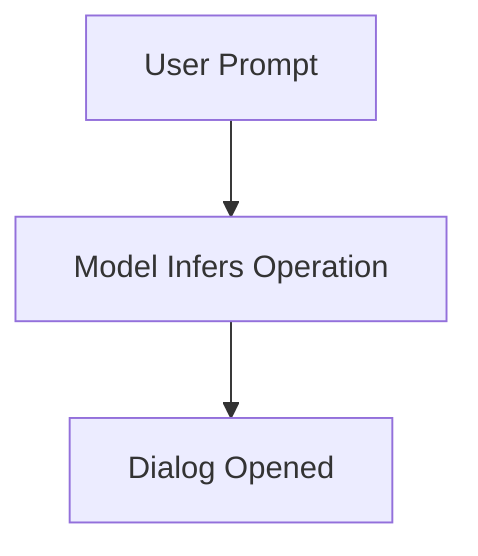
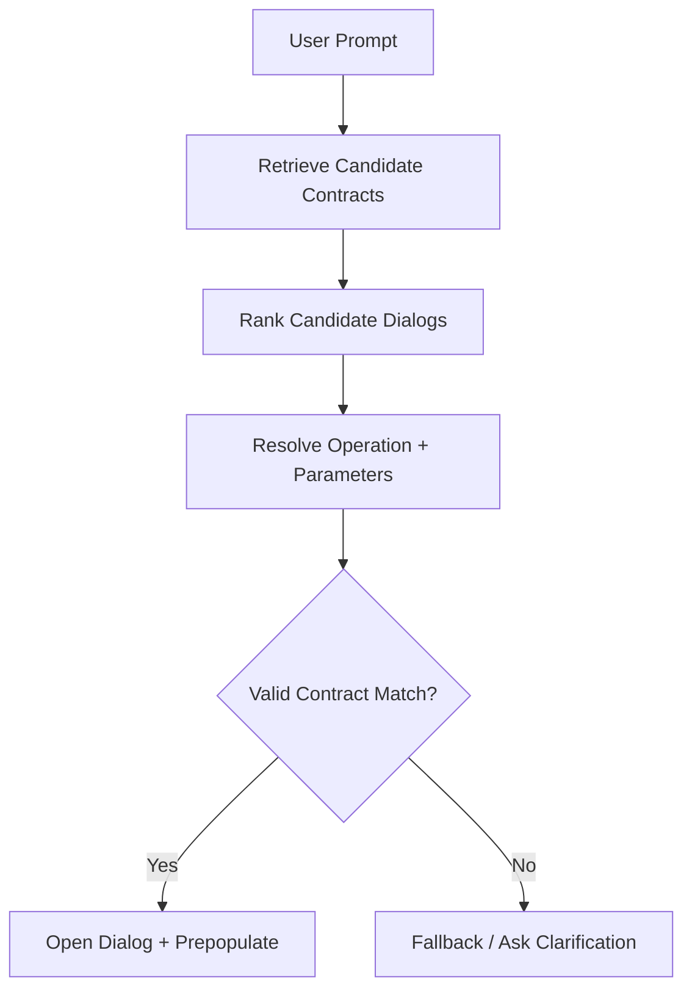
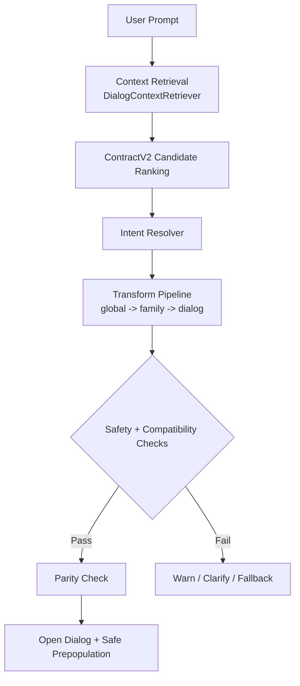

# AI Integration

## Retrieval Strategy

- Feature flag: `AIConfigService.retrievalSettings.useDialogContractRetrieval`
- Current scope: plotting intents only
- Candidate source: `DialogContractV2Registry.getPromptContracts()`
- Ranking: token overlap, retrieval keywords, family intent hints, and active dataframe compatibility
- Fallback: full contract list if retrieval confidence is low

## Logic Flow Progression

### Level 1 - Simple (single-pass intent mapping)

### Level 2 - Structured (retrieval + validation)

### Level 3 - Current branch flow (governed decision path)

## Resolver Pipeline

- Pipeline implementation: `ResolverTransformPipeline`
- Current modules:
  - global: infer missing fields, normalize column references
  - dialog: filter combine logic, bar-chart state normalization
- Diagnostics: applied transform IDs available from pipeline result

## Safety Constraints

- Resolver validates operation ID, dialog compatibility, and parameter types.
- Code steps are blocked for side-effect patterns (filesystem/system commands).
- Low-confidence steps are surfaced as warnings.
