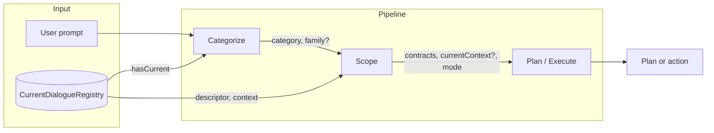
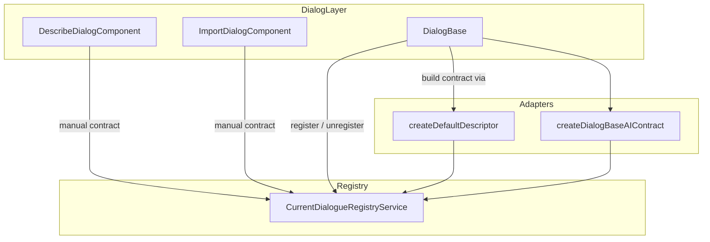
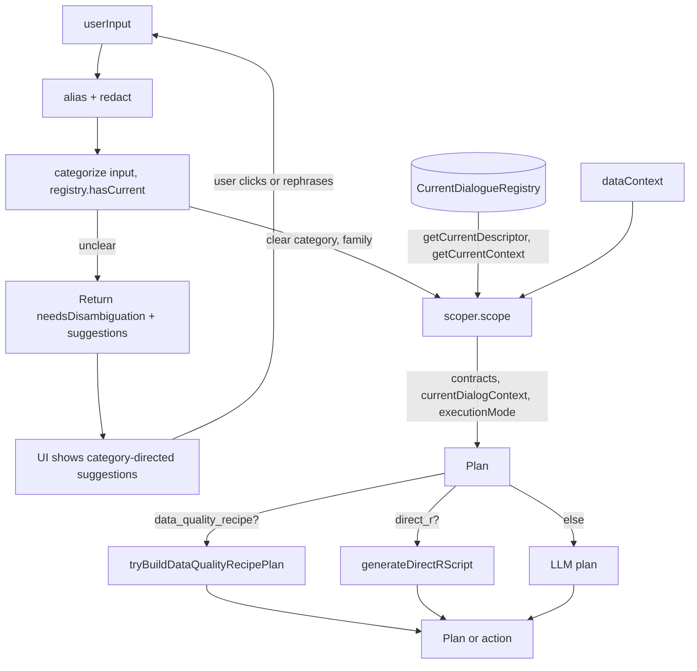

# AI Integration: Logic Flow and Code Areas

This document describes the AI integration from high-level flow down to main code areas and deeper detail. There is **one consistent path**: user prompt → **Categorize** → **Scope** → **Plan/Execute**. Contract and registry are the single way dialogs expose themselves to the AI.

---

## 1. Overview (shallow)

When the user submits a prompt, the system:

1. **Categorizes** the prompt (e.g. open a dialog, refine current dialog, run R code, education question).
2. If the category is **unclear**, the pipeline returns **disambiguation**: the UI shows category-directed suggestions; the user chooses one or rephrases. No Scope or Plan step runs.
3. Otherwise, **Scopes** to a contract set and optional current-dialogue context (using the current-dialogue registry for “refine”).
4. **Plans or executes** using existing AIClientService (LLM or deterministic shortcuts). Plan-level **clarification questions** are directive: each leads to a single clear next step (e.g. choosing a column or confirming an assumption).

Dialogs **register** a descriptor and context with the **current-dialogue registry** when they open and **unregister** when they close. The AI layer never talks to DialogBase or form state directly; it only uses the contract and the registry.

---

## 2. Main code areas

| Area | Location | Responsibility |
|------|----------|----------------|
| **Contract types** | `core/ai/current-dialogue-contract.ts` | `DialogueAIDescriptor`, `DialogueAIContext`, `DialogueAIContract`. The dialogue fulfills this; the registry consumes it. |
| **Registry** | `core/ai/current-dialogue-registry.service.ts` | Single “current” registration. `register(dialogId, contract)`, `unregister(dialogId)`, `getCurrentDescriptor()`, `getCurrentContext()`, `hasCurrent()`. No dependency on dialogs or R codegen. |
| **Adapters** | `core/ai/dialogue-ai-adapters.ts` | QoL: `createDefaultDescriptor`, `createDefaultContextProvider`, `createDialogBaseAIContract`. Build a contract from id/name/variables/code. |
| **Layer 1 – Categorizer** | `core/ai/prompt-categorizer.service.ts` | `categorize(userInput, hasCurrentDialog)` → `Promise<{ category, family? }>`. **Compositional:** rule-based strategy first (`categorizer-rules.ts`); when it returns null, LLM is used. Returns `unclear` when the API is unavailable or intent is genuinely ambiguous. |
| **Layer 2 – Scoper** | `core/ai/prompt-scoper.service.ts` | `scope(category, family?, userInput, dataContext, topK)` → `{ contracts, currentDialogContext, executionMode }`. Uses registry for refine path; uses retrieval (optionally family-scoped) for open_dialog. Not called when category is unclear. |
| **Layer 3 – Plan/Execute** | `core/services/ai-client.service.ts` | When category is **unclear**, returns `needsDisambiguation` and `disambiguationSuggestions` (no Scope/Plan). Otherwise: scope → build message → LLM or direct R. Planner context is built from **scoped operations** (only operations whose dialogs are in scope) and **compact contract views** (dialogId, description, operations, paramNames) via `planner-context.ts`; param reference remains the single authority for state keys. Injects current-dialogue context and current category. For **structured codegen**, compiles dialog steps to R via `step-to-r.ts`. |
| **Step-to-R** | `core/ai/step-to-r.ts` | Single adapter: maps AI plan step state (dialogId + schema-shaped state) to existing dialog R builders (buildSort, buildTTest, etc.). Returns builder output script or null. Ensures one source of truth for how each dialog produces R. |
| **Retrieval** | `core/ai/dialog-context-retriever.ts` | `retrieveDialogContractsTopK(userInput, contracts, dataContext, topK, family?)`. Family filter narrows the set before scoring. **Retrieval hints:** dialogs with V2 overlays in `dialog-contract-v2.registry.ts` supply `retrievalHints.keywords` for better matching; more dialogs have overlays (filter, sort, scatter, boxplot, t-test, regression, correlation, calculate, rename, recode, etc.). |
| **Dialog registration** | `dialog-base.ts`, Describe, Import | DialogBase: register at end of `initializeDialog()` via adapters; unregister in `ngOnDestroy()`. Describe/Import: manual register in `ngOnInit()`, unregister in `ngOnDestroy()`. |

**Single path:** All prompt handling goes through **categorize → scope → plan**. No separate “legacy” contract selection; the scoper is the only producer of the contract set and current context for the planner.

---

## 3. Data flow (deeper)

### 3.1 Dialogue → Registry (registration)

Dialogs are the only writers to the registry. They build a `DialogueAIContract` (often via adapters) and call `registry.register(this.dialogId, contract)` when ready; they call `registry.unregister(this.dialogId)` on destroy.

### 3.2 Pipeline: Categorize → Scope → Plan

AIClientService owns the sequence. It never reads DialogBase or form state; it only uses the registry and the scoper’s output.

### 3.3 Structured codegen (step-to-R)

When the pipeline produces dialog steps and execution mode is **structured_codegen**, AIClientService compiles each step to R via **`step-to-r.ts`**. The adapter takes `dialogId` and schema-shaped `state`, maps them to the corresponding **dialog R builder** (e.g. `buildSort`, `buildTTest`, `buildRegression`, `buildBarChart`), and returns the builder’s `RSyntax.toScript()` output. If state is incomplete or the builder would emit a placeholder (e.g. “# Select a dataframe first”), the adapter returns null and the step is skipped. This keeps a **single source of truth**: the same builders used by the dialog UI are used for AI-generated plans, so generated R matches dialog behaviour and benefits from any builder option (e.g. t-test alternative/confLevel, regression summary/anova).

### 3.4 Scoper behaviour by category

| Category | Contracts | currentDialogContext | executionMode |
|----------|-----------|----------------------|---------------|
| `refine_current_dialog` | One contract for current dialog (from ContractV2 by descriptor.id), or fallback to open_dialog | From registry | `component_codegen` |
| `open_dialog` | From retrieval over V2 contracts (optionally family-filtered) | `null` | `component_codegen` |
| `run_code` | `[]` | `null` | `direct_r` |
| `education_question` | `[]` | From registry (so model can explain current state) | `component_codegen` |
| `data_quality_recipe` | `[]` | `null` | `component_codegen` |
| `unclear` | Pipeline does not scope; returns `needsDisambiguation: true` and `disambiguationSuggestions` for the UI. User chooses a direction or rephrases. | — | — |

### 3.5 Unclear → disambiguation flow

When the categorizer returns **unclear**, AIClientService does **not** call the scoper or planner. It returns immediately with `success: false`, `needsDisambiguation: true`, and `disambiguationSuggestions`: a list of category-directed options (e.g. “Open a dialog”, “Run R code”, “Education question”, “Data quality workflow”, and “Refine current dialog” only when a dialog is open). The AI Assist UI shows these as clickable options; clicking one sends that suggestion’s text as the next user message, so the pipeline runs again and the categorizer typically assigns the corresponding category. Each step thus leads to a clear direction; there is no guessing via heuristics when intent is unclear.

### 3.6 Clarification questions (directive)

Plan-level **clarification questions** (from the planner LLM) are required to be **directive**: each question must have an answer that leads to a single clear next step (e.g. choosing a column, choosing between two analyses, or confirming an assumption). The planner prompt instructs the model to prefer questions with a small, finite set of answers and to avoid open-ended “Can you tell me more?” unless unavoidable. The current intent category is passed into the planner so clarification stays within that path (e.g. for `open_dialog`, ask which dialog/params; for `education_question`, ask which concept).

---

## 4. File map (reference)

| File | Role |
|------|------|
| `current-dialogue-contract.ts` | Contract types only. |
| `current-dialogue-registry.service.ts` | Registry; contract-only API. |
| `dialogue-ai-adapters.ts` | Helpers to build descriptor and contract from id/name/variables/code. |
| `pipeline-types.ts` | `PromptCategory`, `CategorizerResult`, `CategorizerStrategy`. |
| `categorizer-rules.ts` | Rule-based categorizer strategy (pure); evaluated first. |
| `prompt-categorizer.service.ts` | Layer 1: composes rule-based then LLM `categorize()`. |
| `planner-context.ts` | Pure builders: `filterOperationsForScopedDialogs`, `buildPlanningContractViews`. |
| `prompt-scoper.service.ts` | Layer 2: `scope()`; uses registry + retrieval. |
| `dialog-context-retriever.ts` | Retrieval with optional `family` filter. |
| `ai-client.service.ts` | Layer 3: call flow, message building, LLM/direct R. Uses `step-to-r` for structured codegen. |
| `step-to-r.ts` | Adapter: dialogId + state → builder options → builder → script. Single source of truth for template R generation. |
| `dialog-base.ts` | Register/unregister via adapters in init/destroy. |
| `describe-dialog.component.ts` | Manual register/unregister for Describe. |
| `import-dialog.component.ts` | Manual register/unregister for Import. |

---

## 5. Alignment with existing pieces

- **dialogId:** Same as in `dialog-identity.registry` and host keys; descriptor `id` matches.
- **ContractV2 / schema:** Static source for prompts and retrieval. The **runtime** contract (registry) is additive: “what is open and what is its context?” Used by the scoper for refine and by the planner when current context is injected.
- **Family:** `DialogFamily` on ContractV2 is used for family-scoped retrieval in the scoper when category is `open_dialog` and family is known.

No duplicate “ways” to choose contracts: the **scoper** is the single place that produces the contract set and current-dialogue context for the plan step.
