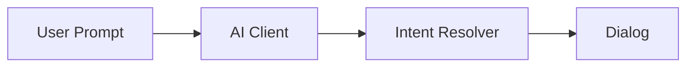
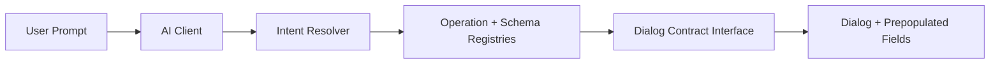
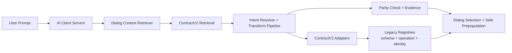

# Architecture

## Target Model

- `DialogContractV2` is the canonical dialog definition source.
- Legacy consumers (schema registry, operation registry, identity mapping, prompt contracts) are fed via adapters.
- AI prompt context is retrieval-based for ContractV2 dialogs behind a feature flag.
- Resolver normalization is a pluggable pipeline with scoped transforms:
  - global
  - family
  - dialog

## Architecture Progression

### Level 1 - Simple (intent to dialog handoff)

### Level 2 - Structured (contract-backed interface layer)

### Level 3 - Current branch shape (governed and extensible)

## Versioning

- Contract version: implicit `v2` by file/module namespace.
- Migration state is tracked per dialog in `DialogContractV2.migration`.
- Backward compatibility is preserved through adapter outputs until a family is fully migrated.

## Extension Points

- Add new family contracts in `dialog-contract-v2.registry.ts` (or split per family when larger).
- Add retrieval scoring features in `dialog-context-retriever.ts`.
- Register new resolver transforms via `ResolverTransformPipeline` in `intent-resolver.service.ts`.

## Pilot Scope

- Plotting family pilot:
  - `bar-chart`
  - `histogram`
